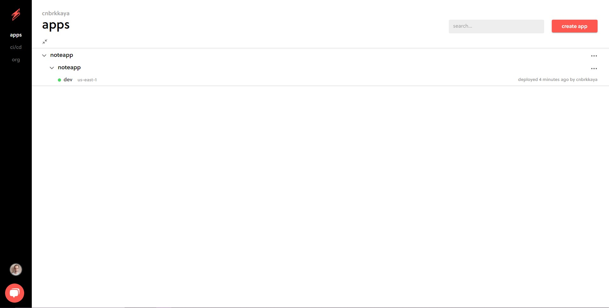

# A Serverless Note API

This project demonstrates how to create a REST API with the ability to create, read, update, and delete Notes.

This is an example project using the Serverless framework and Node.js

This project uses Amazon DynamoDB as a data source, API Gateway for API management, and AWS Lambda for business logic

If you want to see the front end - the client side of this project you can visit this Github link

https://github.com/cnbrkkaya/serverless-http-api-client

or if you want to see it in a live environment you can visit

https://main.d3dt2bvfcoektv.amplifyapp.com/

## File Structure

- ### Config Directory

It contains aws-sdk DynamoDB configurations.

- ### Functions Directory

There are 5 different AWS Lambda functions for each note operation. It contains Create, Delete, Get, List, and Update note functions.

- ### Utils Directory

Utility functions are stored here. It contains a custom sendResponse function.

- ### serverless.yml File

It contains all AWS resource configurations.

## How to Deploy This Project

### Pre-Requisites

To deploy this project, you’ll need the following:

1. An AWS account.
2. AWS CLI installed locally.
3. NodeJS
4. Serverless framework installed locally via ` npm -g install serverless.`

### Setup

Clone repository

```bash
npm install
```

### Deploy

Once all pre-requisite items are ready, run this command:

```bash
serverless deploy
```

## Usage

You can create, get, list, update and delete todos with the following commands.

### Create Note

```
curl -X POST https://XXXXXXX.execute-api.us-east-1.amazonaws.com/dev/note/create --data '{"noteMessage":"My Message"}'
```

### Get Note

```
//replace id part with actual note id

curl -X GET https://XXXXXXX.execute-api.us-east-1.amazonaws.com/dev/note/{id}

```

### List Notes

```

curl -X GET https://XXXXX.execute-api.us-east-1.amazonaws.com/dev/note/list

```

### Update Note

```

curl -X PUT https://XXXXX.execute-api.us-east-1.amazonaws.com/dev/note/update  --data '{"noteId": <id>,"noteMessage":"Updated Message"}'

```

### Delete Note

```
//replace id part with actual note id

curl -X DELETE https://XXXXX.execute-api.us-east-1.amazonaws.com/dev/note/delete/{id}

```

## CI/CD

The CI/CD pipeline of this project is built using Serverless Console CI/CD

Each commit in the main branch of this git repository triggers a new build and deploys the app in the AWS account.

Here are the steps on how to set up this workflow.

1. After deploying your application to the Serverless console head to app.serverless.com and click your application
   

2. Click Settings
   

3. Select CI/CD from left navigation.
   

4. Connect your Github Profile and find your project code repository. Set your build settings. Define your aws region and choose build machine size. Choose your branch and the corresponding stage of your API.
   

5. You can set custom notifications from the add notification section after deployment events.
   

# Feedback

If you have any feedback about this project you can contact me at dev.canberkkaya@gmail.com
